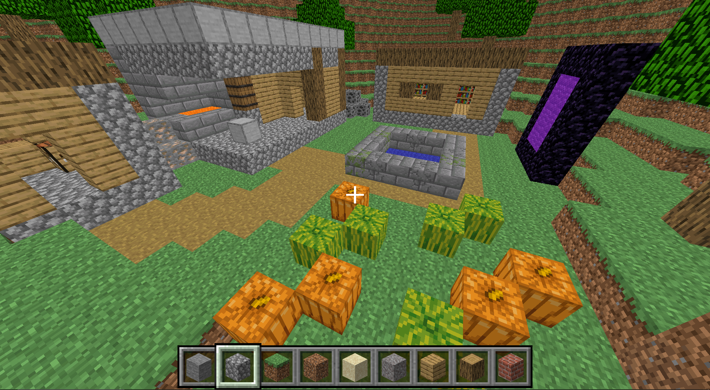

# Voxel Game Engine
A Minecraft-inspired voxel game written in C++ and using OpenGL.

## Key Features
- ***Infinite Terrain***: Perlin noise algorithm is used to procedurally generate infinite terrain.
- ***Break/Place Blocks***: Utilized raycasting to implement block placing and breaking mechanics.
- ***Chunk Management***: Chunk-based rendering system dynamically loads and unloads chunks nearby the player.
- ***Performance Optimizations***: Leveraged techniques such as frustum culling and face culling to enhance performance.

## In-game Screenshot

